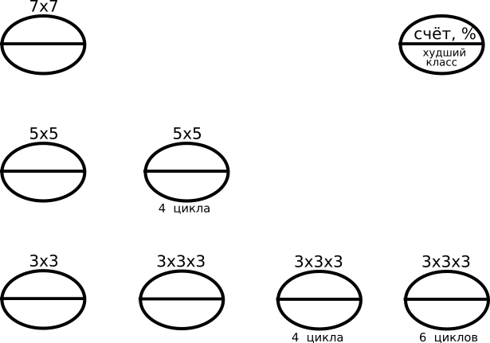

Конволюционные нейросети и Google Colab
=============================================

План выполнения
---------------

Зайдите на https://colab.research.google.com

Чтобы понять, как работает сеть и заполнить клетку `5x5`, создайте блокнот на основе [ipk_lab1.ipynb] (File - Upload Notebook).

Следуйте всем шагам и обучите нейронную сеть распознавать изображения. Когда вы прочитаете все ячейки блокнота, в клетку `5x5` можно будет занести процент правильно распознанных примеров и наименее "удачливый" объект, с наименьгим процентом успешного распознавания.

**Распределить задачи:** кто будет запускать какую сеть. Для каждой сети (`7x7`, `3x3x3`, ...) написать в общем отчёте, какой финальный счёт имел классификатор и какой из объектов классифицировался хуже всего.

**Замечание:** *если сохранить блокнот на свой Google-Drive, то будет возможно поместить файл уже обученной модели `result.pt` в папку с блокнотом (File - Locate on Drive, скорее всего Colab Notebooks), то запуская ячейки с кодом сети другой конфигурации можно будет использовать готовые обученные модели и не тратить время на обучение (в выводе не будет вестись счёт циклов обучения).*

Чтобы обучить или запустить остальные модели и построить общйи график, создайте новую ячейку в прежнем блокноте, поместите туда код из `.py` файла соответствующей модели, и, из этой же папки, и поместите в домашнюю директорию этого блокнота (`Colab Notebooks`) файл `result.pt`.

Какое направление улучшения сети лучше предложить на основе этой информации для повышения точности распознавания?

Приведите ваш ответ:
